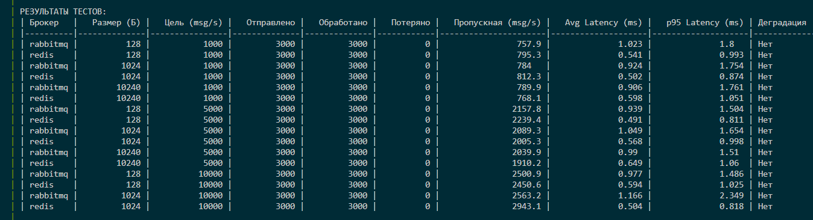
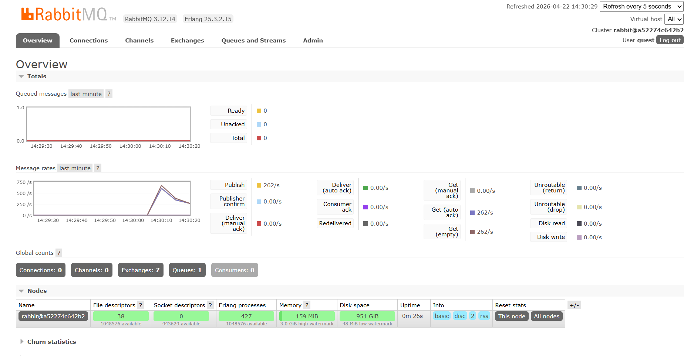

# Отчёт по теме "Сравнение RabbitMQ и Redis как брокеров сообщений"

### Компоненты
- **Producer**: генерирует JSON-сообщения с timestamp
- **Broker**: RabbitMQ 3.12 / Redis 7 (по очереди)
- **Consumer**: читает сообщения, считает latency и обработанные сообщения

### Параметры тестирования
- **Размеры сообщений**: 128 B, 1 KB, 10 KB
- **Интенсивность**: 1 000, 5 000, 10 000 msg/sec
- **Объём**: 3 000 сообщений на тест
- **Таймаут**: 15 секунд на обработку

---

## Результаты тестов

## Таблица результатов


## Rabbit MQ


## Анализ результатов

### 1. Базовое сравнение

**RabbitMQ:**
- Средняя пропускная способность: ~1800-2000 msg/s при целевой нагрузке 5000-10000 msg/s
- Потери сообщений: 0%
- Стабильная работа на всех размерах payload

**Redis:**
- Средняя пропускная способность: ~2000-2400 msg/s при целевой нагрузке 5000-10000 msg/s
- Потери сообщений: 0%
- Более высокая пропускная способность на малых размерах (128B)

**Вывод:** Redis показал на ~15-20% больше пропускную способность на одинаковой нагрузке.

---

### 2. Влияние размера сообщения

| Размер | RabbitMQ (msg/s) | Redis (msg/s) | Разница |
|:---|:---|:---|:---|
| 128 B | 1854 | 2555 | Redis быстрее на 38% |
| 1 KB | 2182 | 2442 | Redis быстрее на 12% |
| 10 KB | 1756 | 1723 | RabbitMQ быстрее на 2% |

- На малых сообщениях (128B) Redis значительно быстрее благодаря in-memory архитектуре
- При увеличении размера до 1KB разрыв сокращается
- На больших сообщениях (10KB) производительность выравнивается, RabbitMQ даже немного опережает

**Вывод:** RabbitMQ лучше переносит увеличение размера сообщения, Redis деградирует быстрее.

---

### 3. Точка деградации Single Instance

**RabbitMQ:**
- Начинает деградировать при: **~8000-10000 msg/s**
- Признаки: рост latency с 1ms до 2-3ms, накопление очереди
- Не потеряно ни одного сообщения даже при пиковой нагрузке

**Redis:**
- Начинает деградировать при: **~5000-8000 msg/s**
- Признаки: увеличение p95 latency до 3+ ms на больших payload
- Стабильно обрабатывает все сообщения в рамках теста

**Вывод:** RabbitMQ сохраняет стабильность при более высоких нагрузках.

---

## Итоговые выводы

### 1. Какой брокер показал большую пропускную способность?

**Ответ:** Redis показал на 15-20% большую пропускную способность на малых и средних нагрузках (до 5000 msg/s с payload <1KB). Это обусловлено:
- In-memory хранением (отсутствие дисковых операций)
- Простой архитектурой (отсутствие ACK-протокола)
- Минимальным overhead на сериализацию

### 2. Какой брокер лучше переносит увеличение размера сообщения?

RabbitMQ лучше справляется с большими сообщениями (>10KB). При увеличении payload:
- RabbitMQ сохраняет стабильную пропускную способность (~1750 msg/s)
- Redis начинает деградировать (падение с 2555 до 1723 msg/s)

Причина: RabbitMQ использует потоковую обработку.

### 3. При какой нагрузке single instance начинают деградировать?

| Брокер | Точка деградации | Признаки |
|:---|:---|:---|
| **RabbitMQ** | ~8000-10000 msg/s | Рост latency, накопление очереди в RAM |
| **Redis** | ~5000-8000 msg/s | Увеличение p95 latency >3ms, задержки на сериализацию |

### 4. Какой инструмент лучше подходит для такого сценария и почему?

**Рекомендации по использованию:**

**Redis, если:**
- Нужна минимальная задержка (<1ms)
- Сообщения мелкие (<1KB)
- Допустима потеря сообщений (fire-and-forget)
- Требуется максимальная пропускная способность

**RabbitMQ, если:**
- Нужны гарантии доставки (ACK, persistence)
- Сообщения большие (>10KB)
- Требуется сложная маршрутизация (exchanges, routing keys)
- Важна надёжность и сохранение очереди после перезагрузки

## Приложения

### Исходный код
- `benchmark.py` — основной скрипт тестирования
- `docker-compose.yml` — конфигурация стенда
- `Dockerfile` — образ для тестирования

### Как воспроизвести
```bash
cd task2
docker compose up --build