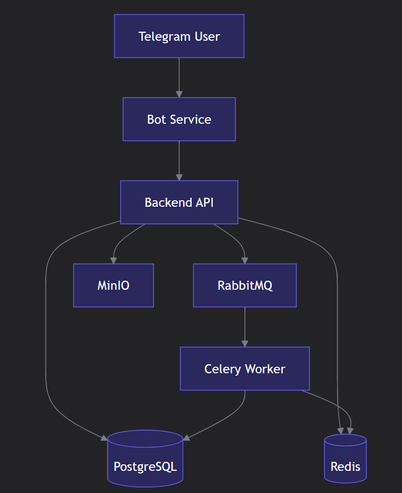

# Dating Bot — Этап 1: Планирование и проектирование

## 1. Сервисы (3 компонента)

### Bot Service
- Telegram бот на aiogram
- Команды: `/start`, `/next`, `/like`

### Backend API  
- Основная логика
- Работа с БД и Redis
- FastAPI + SQLAlchemy

### Worker (Celery)
- Пересчет рейтингов
- Фоновые задачи

---

## 2. Архитектура

Основные компоненты:
1. Bot Service — принимает команды от пользователя Telegram
2. Backend API — обрабатывает запросы, работает со всеми хранилищами
3. Celery Worker — выполняет фоновые задачи (пересчет рейтинга)

Инфраструктура:
1. PostgreSQL — хранит пользователей, анкеты, лайки
2. Redis — кэширует 10 анкет для быстрой выдачи
3. RabbitMQ — очередь для асинхронной обработки событий
4. MinIO — хранит фотографии анкет

## 3. Кэширование (Redis)
1. Пользователь запрашивает следующую анкету
2. Backend проверяет Redis кэш
3. Если кэш пуст — загружаем 10 анкет из БД и сохраняем в Redis
4. Пользователь получает анкету из кэша
5. На 10-й анкете цикл повторяется
В результате пользователь не ждёт загрузки из базы данных

## 4. База данных
## Схема базы данных

### USERS
- `id` (bigint, PRIMARY KEY)
- `telegram_id` (bigint)
- `username` (string)
- `created_at` (datetime)

### PROFILES
- `id` (bigint, PRIMARY KEY)
- `user_id` (bigint, FOREIGN KEY → USERS)
- `bio` (text)
- `age` (int)
- `gender` (string)
- `city` (string)
- `completeness_score` (float)
- `rating_score` (float)
- `is_active` (boolean)
- `created_at` (datetime)
- `updated_at` (datetime)

### PHOTOS
- `id` (int, PRIMARY KEY)
- `profile_id` (int, FOREIGN KEY → PROFILES)
- `s3_url` (string)
- `order_index` (int)
- `uploaded_at` (datetime)

### LIKES
- `id` (int, PRIMARY KEY)
- `from_id` (int, FOREIGN KEY → PROFILES)
- `to_id` (int, FOREIGN KEY → PROFILES)
- `action` (string)
- `created_at` (datetime)

### RATING_LOGS
- `id` (int, PRIMARY KEY)
- `user_id` (int, FOREIGN KEY → USERS)
- `score` (float)
- `calculated_at` (datetime)