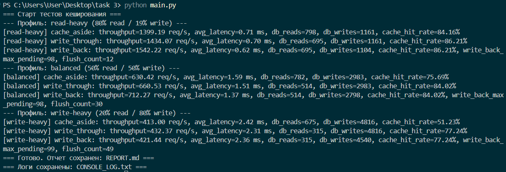

# Отчет по сравнению стратегий кеширования

## Скриншот результата

| Профиль | Стратегия | Throughput (req/sec) | Средняя задержка (ms) | Обращения в БД (read/write) | Hit Rate кеша | Параметры Write-Back |
|---|---|---:|---:|---:|---:|---|
| read-heavy | cache_aside | 1399.19 | 0.71 | 798/1161 | 84.16% | - |
| read-heavy | write_through | 1434.07 | 0.70 | 695/1161 | 86.21% | - |
| read-heavy | write_back | 1542.22 | 0.62 | 695/1104 | 86.21% | max_pending=98, flush_count=12 |
| balanced | cache_aside | 630.42 | 1.59 | 782/2983 | 75.69% | - |
| balanced | write_through | 660.53 | 1.51 | 514/2983 | 84.02% | - |
| balanced | write_back | 712.27 | 1.37 | 514/2798 | 84.02% | max_pending=98, flush_count=30 |
| write-heavy | cache_aside | 413.00 | 2.42 | 675/4816 | 51.23% | - |
| write-heavy | write_through | 432.37 | 2.31 | 315/4816 | 77.24% | - |
| write-heavy | write_back | 421.44 | 2.36 | 315/4540 | 77.24% | max_pending=99, flush_count=49 |

## Выводы

- Профиль `read-heavy`: лучший throughput — `write_back`, лучшая задержка — `write_back`, меньше всего write в БД — `write_back`.
- Профиль `balanced`: лучший throughput — `write_back`, лучшая задержка — `write_back`, меньше всего write в БД — `write_back`.
- Профиль `write-heavy`: лучший throughput — `write_through`, лучшая задержка — `write_through`, меньше всего write в БД — `write_back`.

- Для чтения оптимальна стратегия `write_back`.
- Для записи оптимальна стратегия `write_through`.
- Для смешанной нагрузки оптимальна стратегия `write_back`.

## Примечания

- Все профили выполнены на одинаковом наборе операций (для конкретного профиля).
- Для стратегии write-back отдельно зафиксированы размер накопления незаписанных данных и число flush.
